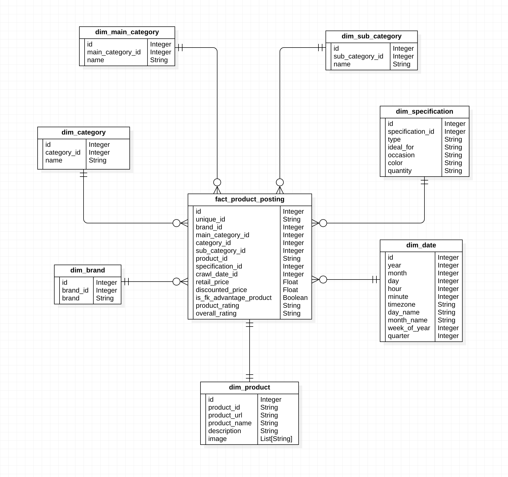

# 2LUX - DATA ANALYTICS PLATFORM

## High Level Data Architecture

- Apache Spark - used for the data processing from bronze to gold layer
- Apache Airflow - for data pipelining and workflow scheduling
- Trino (Hive and Delta catalogs) - for data warehouse / data presentation
- Apache Superset - for data visualization
- Minio - for data lake

## Star Schema

## Software Requirements
* [Docker Desktop Windows](https://hub.docker.com/editions/community/docker-ce-desktop-windows)
* [Docker Desktop Mac](https://docs.docker.com/desktop/install/mac-install)
* [Docker Linux](https://docs.docker.com/install/linux/docker-ce/ubuntu/)
* [Git](https://git-scm.com/book/en/v2/Getting-Started-Installing-Git)
   
## IMPORTANT
* The first time the environment is started, all images will be downloaded to the local machine.
* To run the entire environment, the server/host must have at least 16GB of memory.

### STARTING THE ENVIRONMENT

#### In a terminal/DOS/PowerShell, clone the project to github.
      git clone https://github.com/1byte-yoda/two-lux.git

#### When you clone the repository, the two-lux directory will be created on your local machine.

## EXAMPLES OF HOW TO START THE ENVIRONMENT

   *On Windows open PowerShell, on Linux/Mac a terminal and access the `two-lux` directory*

### To Spin-up all Containers
      make all
This will download the images and Spark jars needed, and then initialize all credentials and database objects required.

### To Stop all Containers
      make down

## TROUBLESHOOTING PROBLEMS

### Checking Running Containers
      docker ps

### Access Container Logs
      docker container logs <name of the container> 

## Web UI Access URL for each Framework
 
* Minio *http://localhost:9051*
* Jupyter Spark *http://localhost:8888*
* Airflow *http://localhost:8280*
* Superset *http://localhost:8088*
* Trino *http://localhost:8080*

## Login Credentials
   ##### Airflow
    Username: airflow
    Password: airflow

   ##### Superset
    Username: admin
    Password: admin
   
   ##### Minio
    Username: admin
    Password: minioadmin

   ##### Trino
    Username: admin

   ##### Postgres
    Username: admin
    Password: admin

   ##### MySQL
    Username: admin
    Password: admin

## Data Profiling
- Check [data profiling notebook](https://github.com/1byte-yoda/two-lux/blob/master/two_lux/jupyter/notebooks/data_profiling.ipynb) for more info

### Future Improvements
- Deploy and translate the architecture into the cloud with a CI/CD configuration
- Impose Data Governance and Security
   - Data lineage - to easily track data movement and be able to reproduce a data issues in the downstream processes.
   - Data Masking for PII data
   - Role Based Access Control - ie. Data Analyst can have access to silver and gold layer while the Management team will only have access to the gold layer
   - Row Level Security - for instance if each product belongs to different warehouses, each warehouse manager will only have access to all records related to their warehouse_id
   - Column Level Security - like all fields related to financial budget of the company is only accessible by the finance and HR team.
   - KeyVaults - Storing secrets into a safer place like Azure KeyVault.
- Upgrade the data loading strategy to use Slowly Changing Dimension.
  - Currently, each table in the data warehouse contains a surrogate key for SCD readiness.
- Increase test coverage of the code.

## Official Documentation for each Container Used

* [Trino](https://trino.io/docs/current/installation/containers.html)
* [Superset](https://superset.apache.org/docs/installation/installing-superset-using-docker-compose/)
* [DeltaLake](https://delta.io/)
* [Minio](https://min.io/docs/minio/container/operations/installation.html)
* [Postgres](https://github.com/docker-library/postgres)
* [Jupyter Spark](https://jupyter-docker-stacks.readthedocs.io/en/latest/using/specifics.html)
* [Airflow](https://airflow.apache.org/docs/apache-airflow/stable/howto/docker-compose/index.html)
